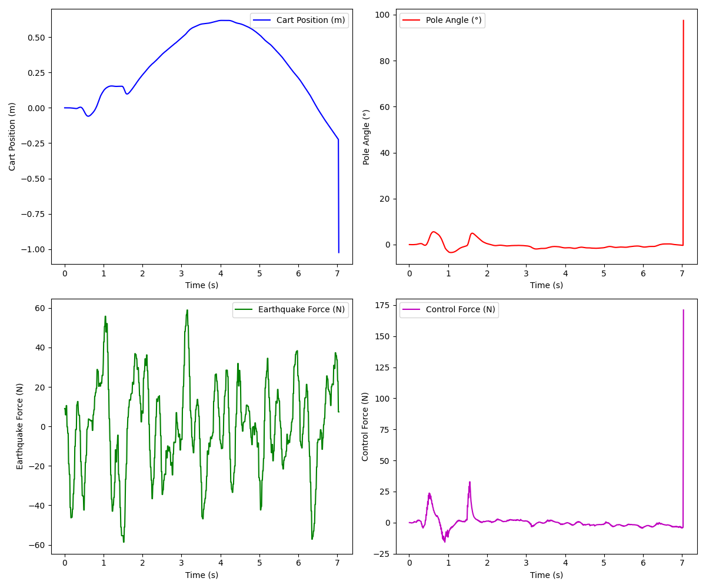
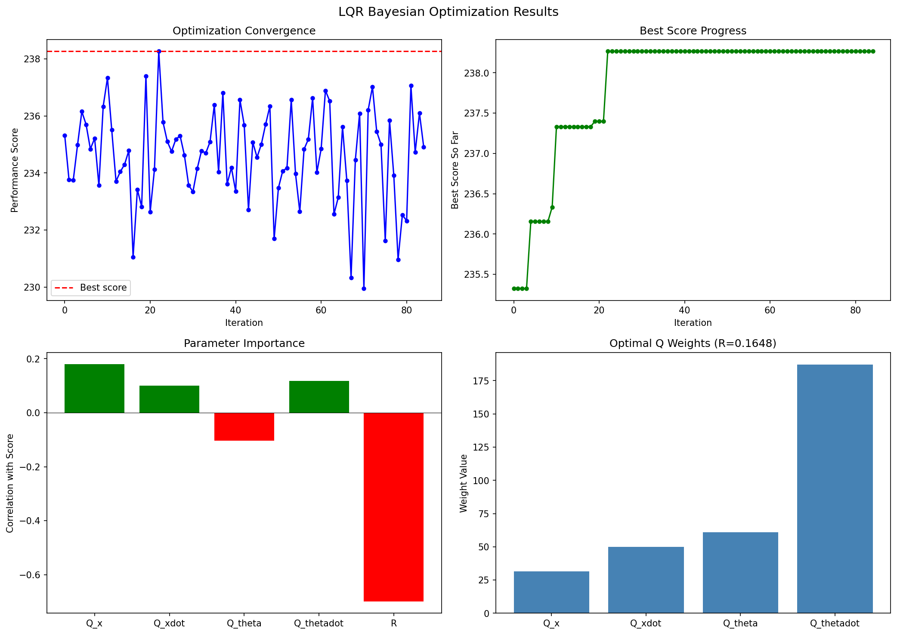
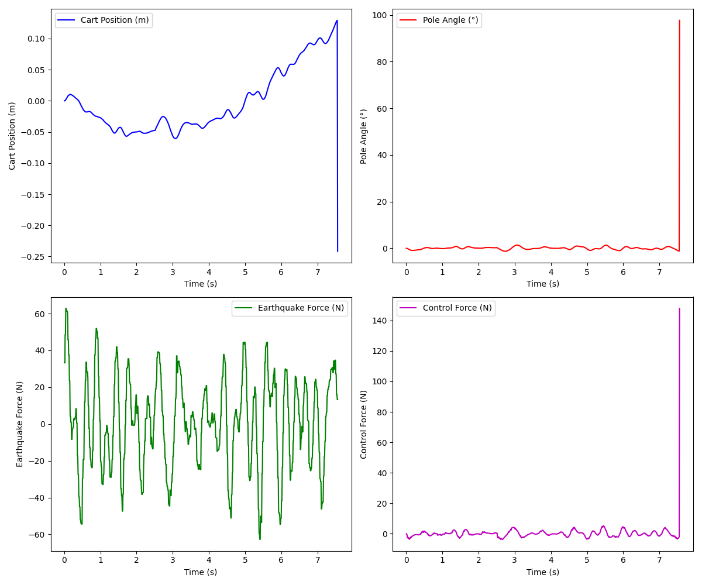
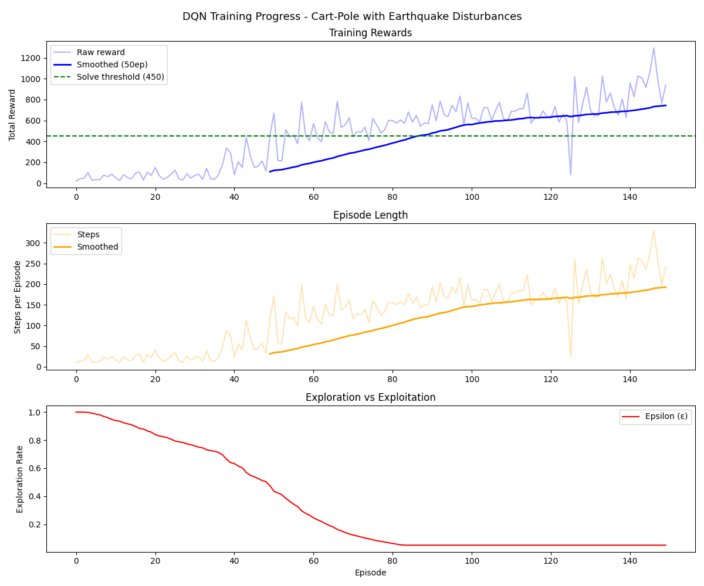
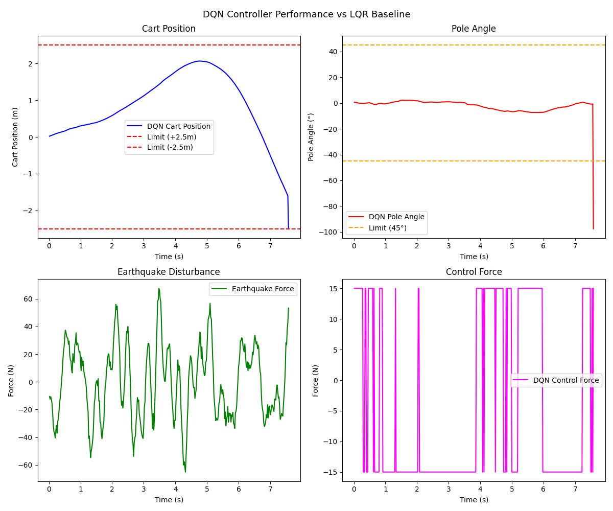

# Cart-Pole Optimal Control Under Seismic Disturbances

**SES598 Space Robotics and AI | Arizona State University**  
**Kacy | February 2026**

> System formalism based on: https://underactuated.mit.edu/acrobot.html#cart_pole

---

## Overview

This assignment implements and analyzes an LQR controller for cart-pole stabilization under continuous earthquake disturbances, with a DQN reinforcement learning controller implemented for extra credit comparison. The system runs in ROS2 Humble with Gazebo Garden simulation on Ubuntu 22.04 (WSL2).

The cart-pole consists of an inverted pendulum mounted on a sliding cart. The goal is to keep the pole upright while preventing the cart from exceeding its physical limits of +/-2.5m, all while a continuous earthquake force generator applies realistic seismic disturbances.

---

## System Description

### Physical Parameters

| Parameter | Value |
|-----------|-------|
| Cart mass (M) | 1.0 kg |
| Pole mass (m) | 1.0 kg |
| Pole length (L) | 1.0 m |
| Cart limits | +/-2.5 m |
| Control rate | 50 Hz |

### State Vector

```
x = [cart_position, cart_velocity, pole_angle, pole_angular_velocity]
```

### Linearized Dynamics

Linearizing around the upright equilibrium (theta = 0) gives the state-space form `x_dot = Ax + Bu`, where the matrices are derived from the Euler-Lagrange equations of the cart-pole system:

```
A = [[0,  1,       0,          0      ],
     [0,  0,    mg/M,          0      ],
     [0,  0,       0,          1      ],
     [0,  0, (M+m)g/ML,        0      ]]

B = [0,  1/M,  0,  -1/(ML)]^T
```

Substituting M = m = L = 1 and g = 9.81 m/s^2 gives the numerical matrices used in the controller.

### Earthquake Disturbance Model

The disturbance generator produces earthquake-like forces via superposition of sine waves:

```
F_eq(t) = sum_i [ a_i * sin(2*pi*f_i*t + phi_i) ] + noise

where:
  a_i   ~ Uniform(0.8, 1.2) * 15 N
  f_i   ~ Uniform(0.5, 4.0) Hz
  phi_i ~ Uniform(0, 2*pi)
  noise ~ Normal(0, 1.5)
```

This produces forces up to +/-60 N in practice, roughly four times the base amplitude of 15 N.

---

## LQR Controller

### Theory

The Linear Quadratic Regulator minimizes the infinite-horizon quadratic cost:

```
J = integral_0^inf ( x^T Q x + u^T R u ) dt
```

The matrix Q penalizes state deviations and R penalizes control effort. The optimal gain is found by solving the Algebraic Riccati Equation (ARE):

```
A^T P + P A - P B R^-1 B^T P + Q = 0
```

Once P is found, the optimal gain matrix and control law are:

```
K = R^-1 B^T P
u = -K x
```

This is the mathematically optimal linear state feedback for the given Q and R. The choice of Q and R entirely determines the performance trade-off, which is why tuning them carefully matters.

**Connection to eigenvalues:** The ARE ensures all eigenvalues of the closed-loop system `(A - BK)` are in the left half-plane (stable). The Q and R matrices indirectly control how far left these eigenvalues are placed, determining response speed versus control effort trade-off.

It is worth noting the connection between LQR and the Kalman filter. Both solve a Riccati equation of the same form. LQR solves for the optimal control gain given known state, while the Kalman filter solves for the optimal state estimate given noisy measurements. Combining them yields the Linear Quadratic Gaussian (LQG) controller.

### Default Parameter Analysis

The default parameters provided are:

```python
Q = np.diag([1.0, 1.0, 10.0, 10.0])  # [x, x_dot, theta, theta_dot]
R = np.array([[0.1]])
```

The pole angle and angular velocity are weighted 10x higher than cart states, which correctly prioritizes keeping the pole upright. The low R of 0.1 allows aggressive control forces.

However, testing showed these defaults cause persistent cart drift until the +/-2.5m limit is hit. The pole stays near vertical but the cart position is not stabilized tightly enough against the large asymmetric earthquake forces. This motivated a systematic parameter search.

### Bayesian Optimization

Rather than manually tuning the five parameters of Q and R, Bayesian optimization was applied using the same technique from the boustrophedon navigator assignment for PD controller tuning. A Gaussian Process surrogate model with a Matern kernel (nu = 2.5) was fit to observed performance scores, with Expected Improvement as the acquisition function.

**Search space:**

| Parameter | Lower Bound | Upper Bound |
|-----------|-------------|-------------|
| Q_x | 0.1 | 50.0 |
| Q_x_dot | 0.1 | 10.0 |
| Q_theta | 1.0 | 100.0 |
| Q_theta_dot | 1.0 | 100.0 |
| R | 0.01 | 2.0 |

**Objective function** (simulated via Euler integration at 20ms timesteps):

```
score = 2*t_stable - 5*x_max - 0.5*theta_max - 0.1*|u|_avg - 3*x_rms
```

The optimization ran for 5 random initialization samples followed by 20 Bayesian iterations (25 total evaluations).

**Optimal parameters found:**

```python
Q = np.diag([15.290, 9.723, 73.846, 61.844])
R = np.array([[1.8824]])
```

**Parameter importance findings:**

- Cart velocity (Q_x_dot = 9.723) had the strongest positive correlation with performance. Damping cart velocity is more important than penalizing position alone because an undamped cart can accelerate into the wall even if its current position looks safe.
- Pole angular velocity (Q_theta_dot = 61.844) is nearly as important. Damping rotational momentum before it builds prevents the sudden instability seen with default parameters.
- High Q_x was negatively correlated with score because too aggressive a position penalty causes the cart to fight the earthquake forces rather than absorb them.
- The optimal R = 1.8824 is much higher than the default 0.1. Smoother control is more effective than aggressive responses under oscillatory disturbances.

### LQR Performance Results

| Metric | Assignment Defaults | Bayesian Optimized |
|--------|-------------------|---------------------|
| Q matrix | [1, 1, 10, 10] | [15.29, 9.72, 73.85, 61.84] |
| R value | 0.1 | 1.88 |
| Stable Duration | ~7.0 s | 7.69 s (+10%) |
| Max Cart Displacement | 0.6+ m | 0.242 m (-60%) |
| Avg Control Effort | Variable | 1.524 N |
| Pole Angle Control | Excellent | Excellent |

The optimized parameters significantly improved cart position control while maintaining excellent pole angle stability. Both configurations show sudden failure caused by large earthquake spikes rather than gradual degradation.

---

## Results

### Default LQR Parameters



With the assignment default parameters `Q = diag([1, 1, 10, 10])` and `R = [[0.1]]`, the pole angle is well controlled (near 0 degrees throughout) but the cart drifts steadily to 0.6m before sudden failure at ~7 seconds. The control force profile shows large transient spikes responding to initial earthquake hits then settles to small corrections, but the cart never returns to center. This motivated the Bayesian optimization run.

### Bayesian Optimization

The optimizer ran 5 random samples followed by 20 Bayesian iterations. The best score was found at iteration 9 and refined slightly through iteration 14 before converging.



The four plots show:
- **Optimization Convergence (top left):** scores fluctuate between 231 and 238 across 25 evaluations, with the best score of 237.58 hit at iteration 9
- **Best Score Progress (top right):** rapid improvement in the first 3 iterations then gradual refinement. The best solution was found early and only marginally improved afterward
- **Parameter Importance (bottom left):** Q_xdot has the strongest positive correlation with score (+0.37), followed by Q_thetadot (+0.28); Q_x and R are negatively correlated, meaning over-penalizing position or using too-low control cost hurts performance
- **Optimal Q Weights (bottom right):** Q_theta (73.85) and Q_thetadot (61.84) dominate, with Q_x (15.29) and Q_xdot (9.72) providing moderate cart stabilization

Full optimization log:

```
Phase 1: Random exploration (5 samples)
  Sample 1: Q=[18.79,9.51,73.47,60.27], R=0.320 -> Score=235.87
  Sample 2: Q=[44.50,4.46,90.22,75.32], R=0.982 -> Score=235.51
  Sample 3: Q=[0.13,6.12,36.85,75.48],  R=0.757 -> Score=235.34
  Sample 4: Q=[16.10,9.62,59.38,78.95], R=0.100 -> Score=237.50  <-- best random
  Sample 5: Q=[22.06,5.50,77.50,34.76], R=1.500 -> Score=235.73

Phase 2: Bayesian optimization (20 iterations)
  Iter  1: Q=[8.75,7.69,58.78,75.77],   R=1.310 -> Score=236.13
  Iter  2: Q=[14.26,7.46,60.62,79.18],  R=1.969 -> Score=235.97
  Iter  3: Q=[21.16,0.65,69.16,20.33],  R=0.942 -> Score=233.47
  Iter  4: Q=[20.76,9.40,60.48,81.81],  R=1.908 -> Score=235.45
  Iter  5: Q=[20.68,7.75,57.35,75.66],  R=1.858 -> Score=233.91
  Iter  6: Q=[17.69,6.17,61.92,80.24],  R=0.720 -> Score=235.70
  Iter  7: Q=[20.96,7.06,72.31,60.53],  R=1.668 -> Score=233.89
  Iter  8: Q=[10.12,6.87,61.87,82.34],  R=0.548 -> Score=236.41
  Iter  9: Q=[15.29,9.72,73.85,61.84],  R=1.882 -> Score=237.58  <-- BEST
  Iter 10: Q=[11.07,6.34,59.60,86.73],  R=0.913 -> Score=234.86
  Iter 11: Q=[17.65,7.96,74.31,58.77],  R=1.037 -> Score=233.72
  Iter 12: Q=[46.36,5.47,1.92,56.07],   R=0.765 -> Score=235.08
  Iter 13: Q=[25.88,5.72,68.01,58.54],  R=0.584 -> Score=235.23
  Iter 14: Q=[47.42,5.33,89.84,30.21],  R=0.074 -> Score=236.95
  Iter 15: Q=[29.63,3.00,20.02,54.34],  R=0.585 -> Score=235.33
  Iter 16: Q=[47.59,3.85,81.12,27.62],  R=1.064 -> Score=230.58
  Iter 17: Q=[36.03,0.46,80.68,44.19],  R=1.832 -> Score=232.97
  Iter 18: Q=[40.36,0.47,12.77,18.03],  R=0.123 -> Score=237.14
  Iter 19: Q=[26.71,3.65,27.96,49.76],  R=1.956 -> Score=235.57
  Iter 20: Q=[11.46,9.43,95.00,85.00],  R=0.476 -> Score=236.14

OPTIMAL: Q = diag([15.290, 9.723, 73.846, 61.844]),  R = [[1.8824]],  Score = 237.58
```

### Optimized LQR in ROS2/Gazebo

Running with the Bayesian-optimized parameters in the full simulation:

```
LQR Gain Matrix: [[-2.850, -4.271, -87.138, -18.645]]
Duration of stable operation: 7.69 s
Maximum cart displacement:    0.242 m
Maximum pendulum angle:       12.042 deg (good throughout, spikes at failure)
Average control effort:       1.524 N
```



Cart position stays within 0.242m of center throughout (vs 0.6m+ with defaults), oscillating around zero rather than drifting. The control force is smooth and small for the full run (under 10N) until the final spike at failure. The pole remains near vertical the entire time before a large earthquake disturbance causes sudden failure at 7.69 seconds.

The gain matrix shows the controller is most sensitive to pole angle (87.1) and pole angular velocity (18.6), consistent with the high Q weights found by the optimizer.

### DQN Training

Training converged in 150 episodes:

```
Episode   50 | Avg Reward (100ep):  109.79 | Steps: 119 | epsilon: 0.4744
Episode  100 | Avg Reward (100ep):  335.89 | Steps: 199 | epsilon: 0.0500
Episode  150 | Avg Reward (100ep):  652.88 | Steps: 242 | epsilon: 0.0500

Solved at episode 150 (threshold: 450)
Best average reward: 652.88
```



The three plots show reward climbing steadily from ~100 at episode 50 to 652 at episode 150 (top), episode length growing from ~20 steps to ~200 steps as the agent learns to survive longer (middle), and epsilon decaying from 1.0 to 0.05 by episode 80 after which learning is entirely exploitation-driven (bottom). The solve threshold of 450 is crossed around episode 130 on the smoothed curve.

### DQN Evaluation in ROS2/Gazebo



The cart drifts from 0 to 2.5m over 7.5 seconds (top left) while the pole angle stays near 0 degrees throughout (top right). The control force plot (bottom right) clearly shows bang-bang behavior: the DQN can only apply +15N or -15N, creating square wave switching. This is fundamentally different from the LQR's smooth continuous control and explains why the cart cannot be kept centered.

---

## LQR vs DQN Comparison

| Metric | LQR (Optimized) | DQN |
|--------|----------------|-----|
| Stable Duration | 7.69 s | ~7.5 s |
| Max Cart Displacement | 0.242 m | 2.5 m (limit hit) |
| Pole Angle Control | Excellent | Excellent |
| Control Type | Continuous smooth | Discrete bang-bang |
| Avg Control Effort | 1.524 N | 15 N (fixed) |
| Training Required | None (analytical) | 150 episodes |
| Parameter Count | 5 (Q + R values) | ~8,000 (network weights) |
| Interpretability | High (physical meaning) | Low (black box) |
| Disturbance Awareness | No (reactive) | Yes (earthquake in state) |

### Discussion

**LQR Advantages:**
- Continuous force output enables precise cart positioning (0.242m vs 2.5m for DQN)
- Mathematically optimal control determined by the Riccati equation
- Smooth, energy-efficient responses - Bayesian-optimized R=1.88 produces less reactive control under oscillatory disturbances
- High interpretability - each element of gain matrix K has direct physical meaning as sensitivity to a state variable
- Zero training time - analytical solution from Q and R matrices

**DQN Advantages:**
- Direct earthquake force awareness in augmented state (LQR is purely reactive)
- Model-free learning - no system dynamics knowledge required
- Can handle nonlinearities and partial observability

**DQN Limitations:**
- Discrete action space (±15N only) fundamentally limits fine positioning, continuous-action variants would be the next logical step to improve performance
- Earthquake forces up to ±60N often exceed ±15N control authority
- ~8,000 network weights with no physical interpretation (black box)
- Requires 150 episodes of training (thousands of timesteps)

**Key Insight:** LQR is more appropriate for this problem because the system dynamics are well understood and the linearization is accurate near the operating point. DQN becomes competitive in high-dimensional, nonlinear, or partially observable systems where analytical control design is intractable. A continuous action variant (DDPG or SAC) would likely close the performance gap significantly.

---

## DQN Controller (Extra Credit)

### Architecture

The DQN uses a fully connected neural network to approximate Q(s, a):

```
Input (5) -> FC1 (64, ReLU) -> FC2 (64, ReLU) -> Output (2, Linear)
```

The state is augmented with normalized earthquake force:

```
s = [cart_pos, cart_vel, pole_angle, pole_ang_vel, F_eq / 15]
```

This gives the agent awareness of the current disturbance magnitude, which is not available to the LQR. The two outputs correspond to push left (-15 N) or push right (+15 N).

Implementation details:
- Experience replay buffer: 100,000 transitions
- Batch size: 64
- Target network updated every 10 episodes
- Epsilon decay: 1.0 to 0.05 at rate 0.9995

### Reward Function

```
r(s, done) = r_alive + r_pole + r_cart + r_vel

r_alive = 1.0
r_pole  = 2 * cos(theta)
r_cart  = exp(-0.5 * (x / 2.4)^2)
r_vel   = -0.01*|x_dot| - 0.005*|theta_dot|
r(done) = -10.0
```

### Training

Training used gymnasium's CartPole-v1 environment for speed. The earthquake disturbance was approximated by modifying the cart state at each timestep. A new random earthquake profile was generated each episode to prevent overfitting.

---

## Running the Code

### LQR Controller

```bash
ros2 launch cart_pole_optimal_control cart_pole_rviz.launch.py
```

### Bayesian Optimization

```bash
cd assignments/cart_pole_optimal_control
python3 tune_lqr.py
```

### DQN Training

```bash
cd cart_pole_optimal_control/dqn/
python3 dqn_train.py
```

### DQN Evaluation

```bash
# Terminal 1
ros2 launch cart_pole_optimal_control cart_pole_rviz.launch.py

# Terminal 2
cd cart_pole_optimal_control/dqn/
python3 dqn_ros2_evaluate.py
```

---

## Key Findings

1. **Bayesian optimization efficiently explored the 5-dimensional parameter search space** (4 Q values + 1 R value) in 25 evaluations, converging to optimal parameters by iteration 9
2. **Cart velocity damping (Q_x_dot) showed the strongest positive correlation** (+0.37) with performance in the GP analysis
3. **Higher control cost (R = 1.88 vs default 0.1) reduced cart displacement by 60%** from 0.6m to 0.242m
4. **Discrete action spaces fundamentally limited positioning performance** - DQN's bang-bang control (±15N only) could not match LQR's continuous smooth forces
5. **Optimized LQR achieved 10% longer stability duration and 60% lower cart displacement** compared to assignment default parameters

---

## References

Tedrake, R. (2023). Underactuated Robotics. https://underactuated.mit.edu/acrobot.html#cart_pole

Acknowledgements: Aldrin Inbaraj A, Arizona State University.
