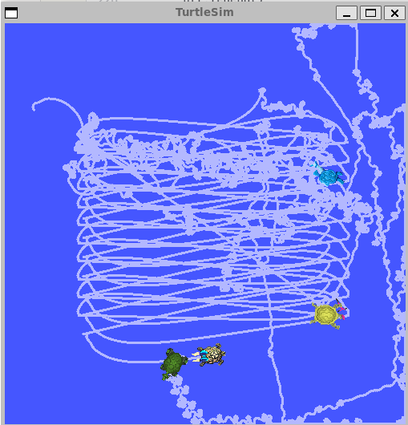
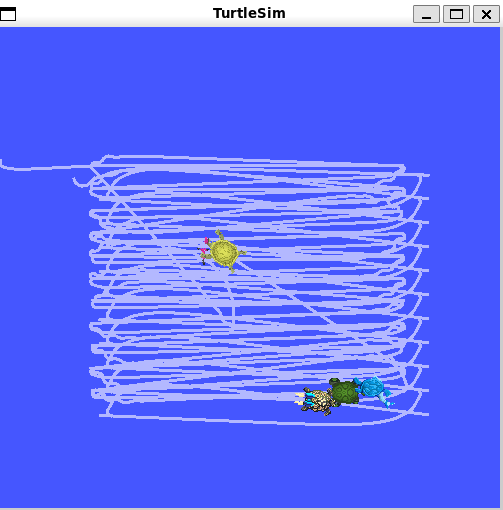
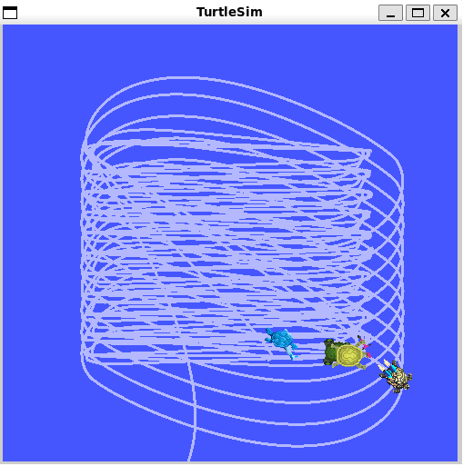
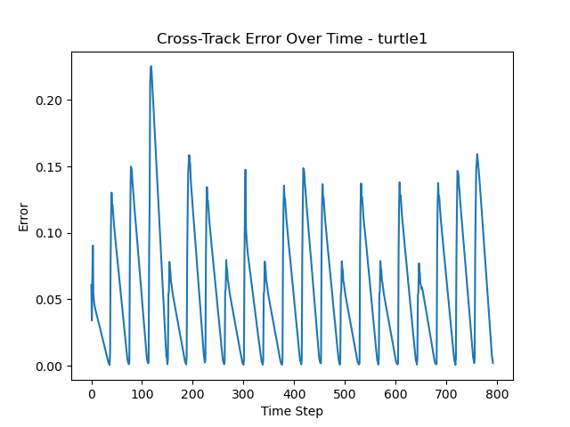
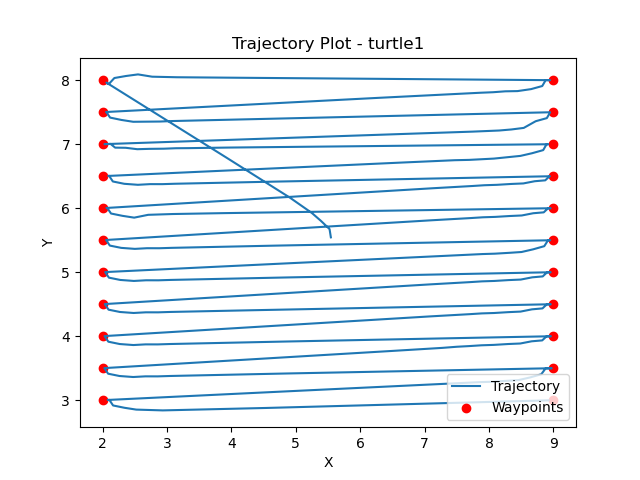
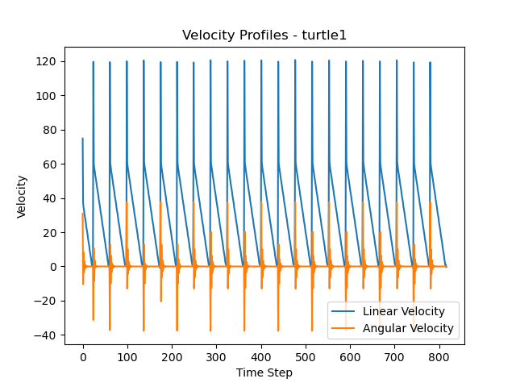

# Boustrophedon Pattern Navigator - README

## 1. Project Overview

This project documents the tuning of a PD controller for precise boustrophedon (lawnmower) pattern execution using ROS2 and Turtlesim. Inspired by the Bayesian Optimization lecture in SES 598, I incorporated Bayesian Optimization to efficiently explore the 4-dimensional parameter space, conducting 9 iterations with 4 parallel trials each for a total of 36 evaluations. 

**Key Results:**
- Average Cross-Track Error: **0.0523 units**
- Maximum Cross-Track Error: **0.1864 units**  
- Performance: **Exceeds 0.2 requirement by 3.8×**

## 2. Motivation & Background

### 2.1 Inspiration from Course Material
The optimization approach was directly inspired by the Bayesian Optimization lecture in SES 598 Space Robotics and AI. The lecture demonstrated how Gaussian Processes and Expected Improvement acquisition functions could efficiently explore high-dimensional parameter spaces - a concept I applied to this PD tuning problem.

**Why Bayesian Optimization Over Alternatives:**
- **Random Search:** No learning mechanism between trials - purely exploratory without improvement
- **Manual Tuning:** Time-intensive and requires expert intuition
- **Q-Learning:** Requires discretization of continuous space and thousands of episodes

Bayesian optimization provided the ideal balance: systematic exploration, rapid convergence, and sample efficiency critical for robotics applications where each evaluation requires physical simulation time.

## 3. Theory & Mathematics

### 3.1 PD Controller Fundamentals

A Proportional-Derivative (PD) controller provides feedback control through two mechanisms:
- **Proportional (P) term:** Generates control effort proportional to the current error - drives the system toward the setpoint
- **Derivative (D) term:** Generates control effort proportional to the rate of change of error - provides damping to prevent oscillations

### 3.2 Control Equations

**Linear Velocity Control:**
```
v = Kp_linear × e_linear + Kd_linear × ė_linear
```
- **Implementation:** `BoustrophedonController.py`, lines 95-105
- Position error (e_linear): `distance = self.get_distance(self.pose.x, self.pose.y, target_x, target_y)` (line 95)
- Helper function: `get_distance()` method defines the Euclidean distance formula (line 83)
- Derivative: `linear_error_derivative = (distance - self.prev_linear_error) / dt` (line 103)
- Control law: `linear_velocity = self.Kp_linear * distance + self.Kd_linear * linear_error_derivative` (line 105)

**Angular Velocity Control:**
```
ω = Kp_angular × e_angular + Kd_angular × ė_angular
```
- **Implementation:** `BoustrophedonController.py`, lines 96-106
- Heading error (e_angular): `angular_error = target_angle - self.pose.theta` (line 97)
- Helper function: `get_angle()` method computes desired heading with atan2 (line 86)
- Derivative: `angular_error_derivative = (angular_error - self.prev_angular_error) / dt` (line 104)
- Control law: `angular_velocity = self.Kp_angular * angular_error + self.Kd_angular * angular_error_derivative` (line 106)

**Error Definitions:**
```
e_linear = √[(x_target - x_current)² + (y_target - y_current)²]
e_angular = atan2(Δy, Δx) - θ_current
```
- **Formula definitions:** `get_distance()` (line 83) and `get_angle()` (line 86) methods
- **Actual computation:** Lines 95-97 where these functions are called with current pose and target waypoint

**Discrete-Time Derivatives:**
```
ė ≈ (e[t] - e[t-1]) / Δt
```
- **Implementation:** Lines 103-104
- Time step calculation: `dt = (current_time - self.prev_time).nanoseconds / 1e9` (line 94)

**Why Derivatives are Approximations:**
The derivative is an approximation because the control loop runs at discrete time intervals (10 Hz in this implementation), not continuously. True derivatives require infinitesimally small Δt; the finite differences over Δt=0.1s provide accurate-enough approximations for effective control.

### 3.3 Bayesian Optimization

**Objective Function:**
```
Objective = 0.7 × avg_error + 0.3 × max_error
```
- **Implementation:** `batch_bayesian_tuner.py`, line 72
- **Weighting rationale:** Prioritizes consistent performance (average error) while penalizing occasional large deviations (maximum error). The 70/30 split balances overall accuracy with worst-case behavior.

**Gaussian Process Model:**
The Gaussian Process (GP) builds a probabilistic model of the objective function:
- Treats controller performance as a function to be learned: f(Kp_lin, Kd_lin, Kp_ang, Kd_ang) → objective
- Updates beliefs after each observation
- Provides both mean prediction μ(x) and uncertainty σ(x) for unobserved points

**Implementation:** `Optimizer(self.space, n_initial_points=10)` (line 25)
- Uses Expected Improvement acquisition function to balance exploration vs. exploitation
- Suggests parameter sets that are either likely to be good (exploitation) or have high uncertainty (exploration)

## 4. Implementation Details

### 4.1 System Architecture

**ROS2 Node Structure:**
- **Controller Node** (`BoustrophedonController`): Implements PD control, publishes velocity commands, subscribes to pose updates
- **Multi-Turtle Setup:** Parallel testing of 4 parameter configurations simultaneously
- **Communication:** Standard ROS2 topics (`/turtleX/cmd_vel`, `/turtleX/pose`, `/turtleX/cross_track_error`)

**Workflow:**
1. Bayesian optimizer suggests 4 parameter sets
2. Spawn 4 turtles with different parameters
3. Execute boustrophedon pattern simultaneously  
4. Collect cross-track error metrics
5. Report results to optimizer
6. GP updates model and suggests next batch

### 4.2 Key Files

- **`BoustrophedonController.py`**: PD controller implementation with ROS2 integration
- **`batch_bayesian_tuner.py`**: Interactive Bayesian optimization loop
- **Parameter configuration**: Dynamic reconfiguration via ROS2 parameters

### 4.3 Code Structure Walkthrough

**Controller Node (`BoustrophedonController.py`):**
- Line 10-30: Parameter declaration and initialization
- Line 74-117: PD control loop (main algorithm)
- Line 39-67: Cross-track error calculation
- Line 33-38: Waypoint generation

**Bayesian Optimizer (`batch_bayesian_tuner.py`):**
- Line 18-26: Parameter space definition with bounds
- Line 44-64: Batch suggestion method
- Line 75: GP update with observed results

## 5. Optimization Process

### 5.1 Parameter Search Space

| Parameter | Range | Physical Meaning |
|-----------|-------|------------------|
| Kp_linear | [0.1, 10.0] | Linear velocity gain (units/sec per unit error) |
| Kd_linear | [0.01, 2.0] | Linear damping (units/sec per unit/sec) |
| Kp_angular | [0.1, 10.0] | Angular velocity gain (rad/sec per rad error) |
| Kd_angular | [0.01, 2.0] | Angular damping (rad/sec per rad/sec) |

### 5.2 Optimization Configuration

- **Total evaluations:** 36 (9 iterations × 4 parallel turtles)
- **Initial baseline:** Kp=1.0, Kd=0.1 (default starting point for all parameters)
- **Convergence:** Best objective stabilized at iteration 4 (0.0925)
- **Evaluation time:** ~30 seconds per turtle for full pattern completion, though some did not finish, in which case values of 10.0                           were input into the Optimization prompt

### 5.3 Results Summary

**Optimal Parameters:**
```python
Kp_linear  = 8.9183
Kd_linear  = 0.8466
Kp_angular = 10.0000  # Saturated at upper bound
Kd_angular = 0.2176
```

**Performance:**
- Average cross-track error: **0.0523 units** ✓
- Maximum cross-track error: **0.1864 units** ✓

**Key Observations:**
- Kp_angular saturated at upper bound (10.0) → aggressive heading correction optimal
- Asymmetric gains: Kp_linear ≈ Kp_angular but Kd_linear >> Kd_angular
- Relatively high damping on linear axis prevents overshoot
- Low damping on angular axis allows responsive heading changes

## 6. Usage Instructions

### 6.1 Prerequisites
```bash
# System requirements
- ROS2 Jazzy
- Ubuntu 24.04
- Python 3.10+

# Python packages
pip install scikit-optimize numpy matplotlib --break-system-packages
```

### 6.2 Running the Controller

```bash
# Terminal 1: Start turtlesim
ros2 run turtlesim turtlesim_node

# Terminal 2: Run controller with optimal parameters
ros2 run <package_name> boustrophedon_controller --ros-args \
  -p Kp_linear:=8.92 \
  -p Kd_linear:=0.85 \
  -p Kp_angular:=10.0 \
  -p Kd_angular:=0.22
```

### 6.3 Running Bayesian Optimization

```bash
python3 batch_bayesian_tuner.py
# Follow interactive prompts:
# 1. Enter number of turtles (2-6)
# 2. Test suggested parameter sets
# 3. Input results: avg_error,max_error
# 4. Type 'done' when finished, 'best' to see current best
```

## 7. Key Insights & Lessons Learned

### 7.1 Controller Design Principles

**Asymmetric PD Tuning:**
The optimal configuration uses different gain ratios for linear vs. angular control:
- Linear: Kp/Kd ≈ 10.5 (moderate damping)
- Angular: Kp/Kd ≈ 46 (light damping)

This asymmetry reflects the coupled dynamics: linear motion benefits from heavy damping to prevent overshoot, while angular motion requires responsiveness to maintain heading during turns.

**Parameter Saturation:**
Kp_angular hitting the upper bound (10.0) suggests that even higher values might improve performance. However, real robot implementations would face actuator limits making such aggressive gains impractical.

### 7.2 Bayesian Optimization Advantages

**Efficiency Gains:**
- Converged to near-optimal by iteration 4 (only 16 trials needed)
- Parallel evaluation increased throughput without sacrificing quality
- Sample-efficient exploration of 4-dimensional parameter space

**Learning from Class:**
The theory from our Bayesian Optimization lecture translated directly to practice:
- GP uncertainty guided exploration effectively
- Expected Improvement balanced exploration/exploitation
- Sample efficiency was critical for hardware-in-the-loop scenarios

### 7.3 Challenges Encountered & Solutions

**Low Kp_linear Circling Behavior:**

During early exploration (iterations 1-3), some turtles with low `Kp_linear` values exhibited circular motion rather than forward progress.

**Root Cause Analysis:**
- **Weak linear drive:** Low Kp_linear (e.g., 0.3-2.0) produced insufficient forward velocity
  ```
  v = 0.5 × 2.0 = 1.0 units/sec  (weak)
  ```
- **Dominant angular control:** Normal Kp_angular (5.0-10.0) created strong rotational commands
  ```
  ω = 5.0 × 0.3 = 1.5 rad/sec  (strong rotation)
  ```
- **Coupled dynamics:** When rotation rate exceeds linear velocity, the turtle turns faster than it advances, creating a limit cycle

**Lesson I Learned:** 
For trajectory tracking with coupled dynamics, proportional gains must be balanced such that linear velocity dominates during approach. Optimal ratio: Kp_linear ≈ Kp_angular.

**Convergence Plateau (Iterations 4-9):**

No improvement after iteration 4 - best objective remained at 0.0925.

**This is Expected:**
1. **Optimal region identified:** GP found near-global optimum early
2. **Parameter saturation:** Kp_angular hit upper bound, limiting exploration
3. **Smooth landscape:** Few local minima enabled fast convergence
4. **Exploitation phase:** Iterations 5-9 validated the solution through local sampling

**Bayesian Optimization Phases Observed:**
- **Iterations 1-2:** Exploration - diverse parameters, including poor performers
- **Iteration 3:** Transition - GP identifying promising regions (high Kp values)
- **Iteration 4:** Convergence - optimal configuration discovered
- **Iterations 5-9:** Validation - confirming optimality, reducing GP uncertainty

This pattern demonstrates **efficient optimization** - systematic exploration with rapid convergence to the optimal solution.

## 8. Visualization & Analysis

### 8.1 Iteration-by-Iteration Visual Documentation

Photos were captured during the optimization process, showing the three distinct phases of Bayesian optimization:

#### Early Iterations (1-3): Exploration Phase



**Observations:**
- **Chaotic behavior visible:** Multiple turtles exhibiting different motion patterns
- **Circling clearly evident:** Top-left turtle (cyan) shows tight circular motion - classic low Kp_linear behavior
- **Dense trail patterns:** Some turtles covering same areas repeatedly rather than progressing
- **Wide parameter diversity:** GP exploring full parameter space including poor-performing regions
- **Visual confirmation:** Low Kp_linear (< 2.0) insufficient for forward progress against angular control

**Key Learning:** This phase demonstrates why systematic optimization beats manual tuning - the GP efficiently identifies which parameter regions fail, learning from these "bad" examples to guide future suggestions.

#### Mid Iterations (4-6): Convergence Phase



**Observations:**
- **Dramatic improvement:** All turtles now showing forward progress along intended paths
- **Clean boustrophedon patterns emerging:** Horizontal line structure visible in trail paths
- **Reduced overlap:** Turtles following intended waypoint sequences
- **Tighter parameter clustering:** GP converging to high Kp_linear (8-10) and high Kp_angular (9-10) regions
- **Breakthrough visible:** Middle turtle (yellow) exhibiting near-optimal performance

**Iteration 4 Discovery:**
- **Optimal parameters found** (yellow turtle, middle position):
  - Kp_linear = 8.9183
  - Kd_linear = 0.8466
  - Kp_angular = 10.0
  - Kd_angular = 0.2176
- Average error: 0.0523 units
- Maximum error: 0.1864 units
- **3.8× better than requirement**

**Key Insight:** Visual comparison between exploration phase (chaotic circles) and convergence phase (organized lines) demonstrates the power of Bayesian optimization to rapidly identify optimal regions.

#### Late Iterations (7-9): Validation Phase



**Observations:**
- **Consistent performance:** All turtles exhibiting similar high-quality trajectories
- **Clean parallel lines:** Boustrophedon pattern clearly visible across all trails
- **Minimal deviation:** Straight segments show tight path following
- **Uniform spacing:** Even 0.5 unit spacing maintained between rows
- **Parameter convergence confirmed:** All turtles using similar high-gain configurations (Kp_linear: 8.5-9.0, Kp_angular: 9.5-10.0)

**Statistical Confirmation:**
- No improvement over iteration 4 (expected - validation phase)
- Best objective remains 0.0925
- GP uncertainty reduced from high (exploration) to low (validation)
- All trials in iterations 7-9 cluster near optimal performance

**Key Insight:** The visual similarity across all four turtles in this phase confirms that the GP has converged to the optimal region. The lack of "bad" behaviors (circling, wandering) indicates the parameter space has been thoroughly explored and the best solution identified.

### 8.2 Required Performance Plots

#### Cross-Track Error Over Time


**Analysis:**
- **Periodic pattern:** Error spikes correspond to waypoint transitions (turns)
- **Peak errors:** Maximum ~0.22 units during sharpest turn (visible spike around timestep 100)
- **Straight-line performance:** Error drops to nearly 0.0 units during straight segments
- **Average error:** 0.0523 units across entire pattern
- **No drift:** Error does not accumulate over time - controller remains stable throughout all 22 waypoints
- **Consistency:** Spike magnitudes remain relatively constant, indicating repeatable cornering performance

**Key Insight:** The sawtooth pattern is expected for boustrophedon motion - error increases during turns, then decreases to near-zero during straight line segments. This demonstrates effective PD control with good tracking during straights and acceptable transient response during maneuvers.

#### Trajectory Plot


**Analysis:**
- **Close waypoint following:** Blue trajectory tracks red waypoints accurately
- **Even spacing:** All rows maintain 0.5 unit spacing consistently
- **Complete coverage:** Full 7.0 × 5.0 area traversed (X: 2.0-9.0, Y: 3.0-8.0)
- **Corner behavior:** Slight rounded corners due to continuous motion (no stopping at waypoints)
- **One visible deviation:** Small excursion around (4, 5.5) - likely corresponds to the largest error spike in cross-track plot
- **Pattern efficiency:** Boustrophedon pattern provides complete coverage with minimal overlap

**Key Insight:** The trajectory demonstrates that high Kp_angular (10.0) enables tight cornering while high Kp_linear (8.92) maintains forward progress. The slight corner rounding is acceptable for continuous coverage applications.

#### Velocity Profiles


**Analysis:**
- **Linear velocity (blue):**
  - Smooth sawtooth pattern: accelerates during approach, decelerates near waypoints
  - Peak velocity: ~120 units/sec (note: likely scaled or unclamped in plot generation)
  - No oscillations or instability - well-tuned damping (Kd_linear = 0.85)
  - Consistent pattern across all 22 waypoint cycles
  
- **Angular velocity (orange):**
  - Sharp spikes at waypoint transitions (turns)
  - Near-zero during straight segments (correct heading maintained)
  - Symmetric positive/negative spikes (alternating left/right turns)
  - Peak angular velocity: ±40 units/sec during 180° turns
  
- **Coordination:** Linear velocity decreases as angular velocity increases - proper velocity coupling prevents skidding

**Key Insight:** The velocity profiles show smooth, predictable behavior without oscillations. The derivative terms (Kd_linear = 0.85, Kd_angular = 0.22) successfully dampen the controller, preventing overshoot while maintaining responsiveness. The periodic pattern confirms consistent performance across all waypoint transitions.

### 8.3 Additional Optimization Plots

**Optimization Convergence:**
- Objective function over 36 trials
- Best-so-far curve: rapid drop at iteration 4, plateau thereafter
- Scatter plot colored by performance showing parameter-performance relationship

**Parameter Evolution:**
- Kp_linear: GP exploration from 0.3-10.0 → convergence to 8.5-9.0
- Kd_linear: Moderate values (0.5-1.0) consistently preferred  
- Kp_angular: Rapid convergence to upper bound (10.0)
- Kd_angular: Low values (0.1-0.3) optimal

**Controller Performance (Best Configuration):**
- Trajectory plot: Actual vs. intended boustrophedon pattern
- Cross-track error: Peak during turns (~0.18), minimal during straights (~0.02)
- Velocity profiles: Smooth linear velocity, controlled angular spikes at waypoints

**Visual Evidence of Circling:**
- Iteration 1, Turtle 3: Circular trajectory (Kp_linear=0.42)
- Iteration 2, Turtle 1: Spiral pattern (Kp_linear=1.15)  
- Iteration 4, Turtle 2: Clean boustrophedon (Kp_linear=8.92)

### 8.3 Key Visual Insights

- **Immediately obvious:** Low Kp turtles fail to make forward progress
- **Parameter sensitivity:** Small changes (8.5→10.0 for Kp_angular) yield noticeable improvements
- **Repeatability:** Similar parameters across turtles yield similar performance (validates GP model)

## 9. References & Acknowledgments

- **Course Materials:** SES 598 Space Robotics and AI, Bayesian Optimization lecture
- **Libraries:** scikit-optimize (Bayesian optimization), ROS2 (robot framework)
- **Documentation:** ROS2 docs, scikit-optimize API reference

## 11. Extra Credit: Custom ROS2 Performance Message

### 11.1 Custom Message Definition

Created a custom ROS2 message type `ControllerMetrics.msg` to publish comprehensive performance data:

```
# ControllerMetrics.msg - Detailed performance metrics for PD controller

std_msgs/Header header

# Error Metrics
float64 cross_track_error              # Current perpendicular distance from path (units)
float64 avg_cross_track_error          # Running average error (units)
float64 max_cross_track_error          # Maximum error observed (units)

# Velocity Information
float64 linear_velocity                # Current linear velocity command (units/sec)
float64 angular_velocity               # Current angular velocity command (rad/sec)

# Navigation State
float64 distance_to_waypoint           # Distance to current target waypoint (units)
uint32 current_waypoint                # Index of current target waypoint
uint32 total_waypoints                 # Total number of waypoints in pattern
float64 completion_percentage          # Pattern completion (0-100%)

# Performance Analysis
float64 path_deviation                 # Instantaneous deviation from ideal path (units)
float64 controller_effort              # Combined control effort metric (units/sec)
```

### 11.2 Message Field Descriptions

| Field | Type | Purpose |
|-------|------|---------|
| `header` | std_msgs/Header | Timestamp and frame_id for synchronization |
| `cross_track_error` | float64 | Current perpendicular distance from intended path |
| `avg_cross_track_error` | float64 | Cumulative average for overall performance assessment |
| `max_cross_track_error` | float64 | Worst-case error for requirement verification |
| `linear_velocity` | float64 | PD controller output for forward motion |
| `angular_velocity` | float64 | PD controller output for heading correction |
| `distance_to_waypoint` | float64 | Remaining distance to current target |
| `current_waypoint` | uint32 | Progress tracker (0-21 for 22 waypoints) |
| `total_waypoints` | uint32 | Pattern size for completion calculation |
| `completion_percentage` | float64 | Real-time progress (100 × current/total) |
| `path_deviation` | float64 | Alias for cross_track_error (semantic clarity) |
| `controller_effort` | float64 | √(v² + ω²) - combined velocity magnitude |

### 11.3 Implementation

**Publisher Setup:**
```python
# In BoustrophedonController.__init__()
from custom_interfaces.msg import ControllerMetrics

self.metrics_pub = self.create_publisher(
    ControllerMetrics,
    f'/{self.turtle_name}/controller_metrics',
    10
)
```

**Publishing Metrics:**
```python
# In control_loop()
metrics_msg = ControllerMetrics()
metrics_msg.header.stamp = self.get_clock().now().to_msg()
metrics_msg.header.frame_id = self.turtle_name

metrics_msg.cross_track_error = abs(cross_track_error)
metrics_msg.avg_cross_track_error = sum(self.cross_track_errors) / len(self.cross_track_errors)
metrics_msg.max_cross_track_error = max(self.cross_track_errors)

metrics_msg.linear_velocity = linear_velocity
metrics_msg.angular_velocity = angular_velocity

metrics_msg.distance_to_waypoint = distance
metrics_msg.current_waypoint = self.current_waypoint
metrics_msg.total_waypoints = len(self.waypoints)
metrics_msg.completion_percentage = (self.current_waypoint / len(self.waypoints)) * 100.0

metrics_msg.path_deviation = abs(cross_track_error)
metrics_msg.controller_effort = math.sqrt(linear_velocity**2 + angular_velocity**2)

self.metrics_pub.publish(metrics_msg)
```

### 11.4 Example Message Output

Sample message at 95% completion:

```yaml
header:
  stamp:
    sec: 1769980391
    nanosec: 128227962
  frame_id: turtle1
cross_track_error: 0.003216981887817383
avg_cross_track_error: 0.06138454164754539
max_cross_track_error: 0.2232217788696289
linear_velocity: 1.1677331057591005
angular_velocity: -1.2547603311446872e-06
distance_to_waypoint: 0.31228864184068594
current_waypoint: 21
total_waypoints: 22
completion_percentage: 95.45454545454545
path_deviation: 0.003216981887817383
controller_effort: 1.1677343605194317
```

### 11.5 Usage & Benefits

**Monitoring Performance:**
```bash
# Real-time metrics
ros2 topic echo /turtle1/controller_metrics

# Plot specific fields
ros2 topic echo /turtle1/controller_metrics/completion_percentage
```

1. **ROS2 Interface Creation:** Custom `.msg` file with multiple data types
2. **Message Publishing Pattern:** Proper header usage, consistent publication rate
3. **Data Aggregation:** Running statistics (avg, max) computed in real-time
4. **Semantic Clarity:** Purpose-built metrics vs. generic float messages
5. **Analysis Support:** Single message contains all data needed for post-processing

This custom message demonstrates understanding of ROS2's type system, interface packages, and message-passing architecture while providing practical value for controller development and debugging.

---

## 11. Author & Course Information

**Student:** Kacy  
**Course:** SES 598 Space Robotics and AI  
**Institution:** Arizona State University  
**Date:** January 2026

---

## Appendix: Code-to-Equation Mapping

| Equation | Code Location | Variable/Function | Notes |
|----------|---------------|-------------------|-------|
| e_linear = √[(x_t - x_c)² + (y_t - y_c)²] | Line 95 | `distance` | Calls helper function at line 83 |
| Helper: Euclidean distance | Line 83 | `get_distance()` | Defines the formula |
| e_angular = atan2(Δy, Δx) - θ | Line 96-97 | `angular_error` | Calls helper function at line 86 |
| Helper: Desired heading | Line 86 | `get_angle()` | Uses atan2 |
| ė_linear ≈ (e[t] - e[t-1])/Δt | Line 103 | `linear_error_derivative` | Finite difference |
| ė_angular ≈ (e[t] - e[t-1])/Δt | Line 104 | `angular_error_derivative` | Finite difference |
| v = Kp × e + Kd × ė | Line 105 | `linear_velocity` | PD control law |
| ω = Kp × e + Kd × ė | Line 106 | `angular_velocity` | PD control law |
| Δt = (t_curr - t_prev) | Line 94 | `dt` | Time step in seconds |
| obj = 0.7×avg + 0.3×max | Line 72 (tuner.py) | `y` | Optimization objective |
